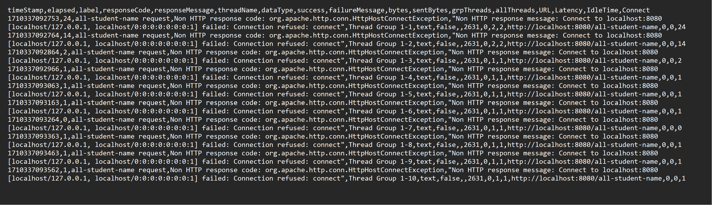
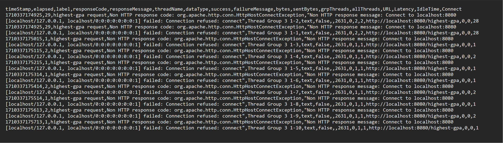

# results for all-student-name:

## result in table all-student-name

## result in tree test all-student-name

## summary report test all-student-name

## result in table highest-gpa

## result in tree highest-gpa

## summary report test highest-gpa

## graph result test highest-gpa

itu deh pokoknya bang

